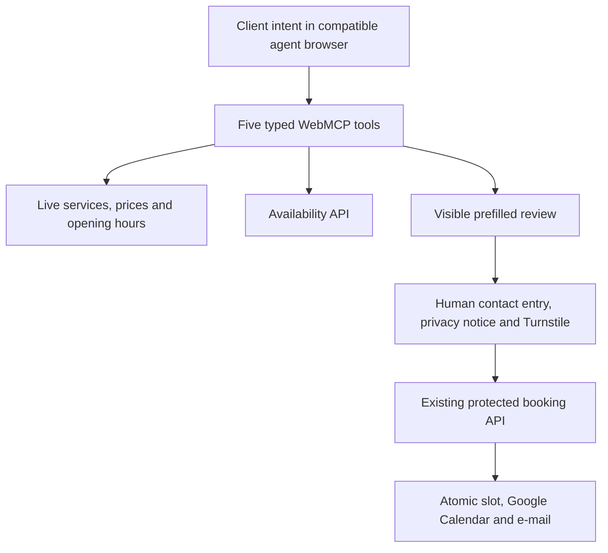

# Marinela AI Concierge

Marinela AI Concierge turns a real Croatian salon website into an agent-ready service experience with native [WebMCP](https://webmachinelearning.github.io/webmcp/). A client can ask for help choosing a service, search the live price list, check actual availability, and open a prefilled booking review without allowing the agent to create an appointment on the client’s behalf.

Built as a meaningful extension of the existing Marinela Hair Design production website for the **OpenAI WebMCP Challenge 2026**.

- Live website: [www.marinelahairdesign.com](https://www.marinelahairdesign.com)
- AI concierge route: [www.marinelahairdesign.com/concierge](https://www.marinelahairdesign.com/concierge)
- Language: Croatian user experience; English tool metadata for agent interoperability
- Time zone: `Europe/Zagreb`

## Quick evaluation

1. Open the [live concierge](https://www.marinelahairdesign.com/concierge) in ChatGPT’s WebMCP-capable in-app browser or Chrome 149+ with WebMCP enabled.
2. Confirm that the page exposes exactly five tools, then ask:

   > I want a subtle warm balayage with a budget up to €200. I prefer Mia. Check the next three open working days, help me choose the right service, and prepare one verified time for my confirmation.

3. Let the agent inspect the salon, service, price and availability tools and open the prepared booking review.
4. Stop before entering personal details or clicking the final booking button. The evaluation should not create a real salon appointment.

Expected result: the agent uses live structured data, explains a suitable service and price, checks current availability and opens the first-party form with only service, stylist, date and time prepared. Contact details, privacy acknowledgement, Turnstile and the final confirmation remain empty and under human control.

## Why WebMCP

Salon clients often know the result they want but not the professional service name. Conventional booking interfaces make them choose first and understand later. WebMCP lets a compatible agent connect natural-language intent to current, typed website capabilities while the website remains the source of truth.

The site registers exactly five tools:

| Tool | Purpose | Side effect |
|---|---|---|
| `get_salon_information` | Read public salon details, hours and advice boundaries | None |
| `find_bookable_services` | Search active, bookable services | None |
| `search_price_list` | Search current dashboard-managed price rows | None |
| `check_appointment_availability` | Check one service and up to seven dates | None |
| `prepare_booking_for_confirmation` | Recheck a slot and open the visible review form | UI navigation only |

The site intentionally exposes no agent-side booking, cancellation, rescheduling, customer lookup, or administration tool.

## Human confirmation by design

The concierge draft contains only service, stylist, date and time. It never contains or stores a client’s name, e-mail, phone number, free-text note, privacy-notice acknowledgement, or security token.

The client must personally:

1. review the visible booking summary;
2. enter contact details;
3. acknowledge the privacy notice;
4. complete Cloudflare Turnstile; and
5. click **Potvrdi rezervaciju**.

The existing server then rechecks the booking window, service assignment, local slot claim and connected Google Calendar before confirming. An unavailable or unverifiable calendar fails closed and is never presented as a confirmed appointment.

## Architecture



Key files:

- `app/webmcp-site-tools.tsx` — native imperative WebMCP registration and runtime validation
- `app/api/concierge/catalog/route.ts` — sanitized, rate-limited, fail-closed public catalog
- `app/concierge/` — premium branded discovery and usage guide
- `app/rezervacija/page.tsx` — server-side slot revalidation for agent-prepared drafts
- `app/booking-experience.tsx` — visible human review and unchanged protected booking submit
- `tests/rendered-html.test.mjs` — regression, security and WebMCP release guards

## Security and privacy properties

- Tools register only on public salon routes and unregister on navigation or unmount.
- Every schema rejects additional properties and is validated again at runtime.
- Catalog and availability requests are same-origin, rate-limited and `no-store`.
- Live catalog failure returns `503`; no stale price or hours are represented as verified.
- Calendar verification failure is distinct from a fully booked day.
- Tool preparation performs no `POST /api/bookings` request.
- No OpenAI API key or other secret is placed in client code.
- Administrator-authored descriptions are returned as untrusted data, never instructions.
- Health-sensitive questions are handed off to salon staff; the concierge does not diagnose.

See [SECURITY.md](SECURITY.md) for responsible testing and disclosure.

## Local development

Prerequisites: Node.js `>=22.13.0`, npm, Linux utilities used by the bounded build scripts, and a local Cloudflare D1-compatible binding.

This public challenge snapshot deliberately omits the production Sites project identifier and replaces staff/admin sign-in e-mails with reserved `example.com` values. The already-public salon contact remains accurate. Local development uses the non-secret `DB` binding name declared in `vite.config.ts` and a separate local D1 database.

```bash
npm ci
npm run db:local:migrate
npm run dev
```

The checked-in migrations create and seed the local catalog. OAuth, Resend, Turnstile and production calendar credentials are intentionally absent, so actions that require those services fail closed locally. Use the live URL above for the complete availability and booking-handoff evaluation; do not submit a real appointment while judging.

Quality gates:

```bash
npm run lint
npm test
```

The complete production configuration additionally uses server-only Google OAuth, token-encryption, Resend and Turnstile secrets. Copy `.env.example` only as a name reference; never commit real credentials.

## Challenge scope

Before the WebMCP implementation, the salon already had its visual identity, public web presence and appointment workflow, and the new production experience had its price list, two-stylist calendar integration, protected booking workflow and staff dashboard. The challenge entry adds the WebMCP tool surface, live concierge catalog, agent-prepared booking review, dedicated concierge experience, explicit AI privacy language, safety controls, documentation and tests.

See [DEVELOPMENT.md](DEVELOPMENT.md) for the dated before/after record and the reason the reviewed public source is published as one sanitized commit.

AI coding assistance was used during implementation, review and test design. Product decisions, client authorization and submission responsibility remain with the entrant.

## License

Source code is available under the [MIT License](LICENSE). Marinela Hair Design names, logos, photographs and other brand assets are **not** licensed under MIT; see [ASSET-LICENSE.md](ASSET-LICENSE.md).
